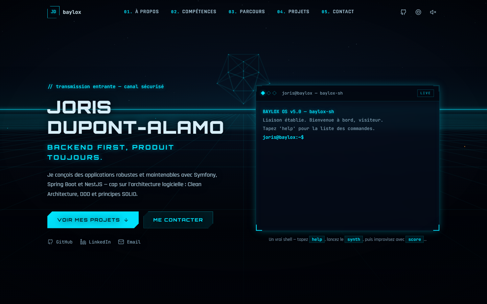
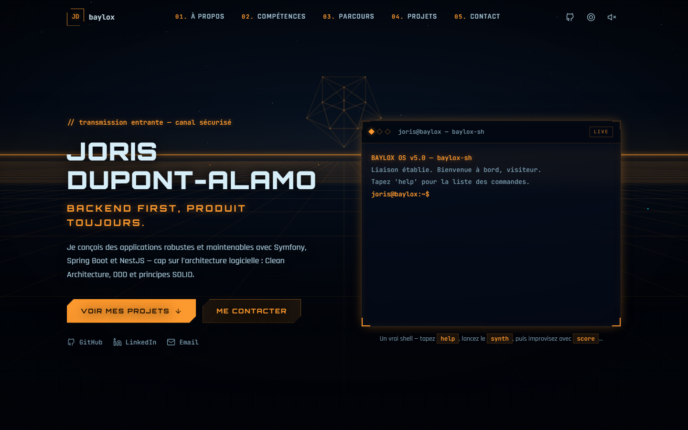

<div align="center">

<pre>
     ██╗██████╗
     ██║██╔══██╗
     ██║██║  ██║
██   ██║██║  ██║
╚█████╔╝██████╔╝
 ╚════╝ ╚═════╝
</pre>

<h1>baylox-sh — Joris Dupont-Alamo's portfolio</h1>

<p><code>// incoming transmission — secure channel</code></p>

<p><strong><a href="https://baylox.github.io/portfoliot/">baylox.github.io/portfoliot</a></strong></p>

<p><a href="README.fr.md">Version française</a></p>

<p>
<a href="https://angular.dev"></a>
<a href="https://www.typescriptlang.org/"></a>
<a href="https://vitest.dev"></a>
<a href="https://github.com/Baylox/portfoliot/actions"></a>
</p>

</div>

> A portfolio you visit the way you board a machine: a perspective grid, a 3D
> wireframe icosahedron, neon tracers drawing their walls of light, a real
> shell — and electro generated note by note with the Web Audio API. Zero
> assets, zero samples, zero graphics or audio libraries: everything is
> computed at runtime.



## 01 — What makes it different

- **Animated Canvas 2D background** — perspective grid, glowing horizon,
  starfield, a **3D wireframe icosahedron** (hand-rolled rotation matrices,
  no Three.js) and neon tracers drawing true right-angle walls of light,
  each within its own territory. The floor senses you: grid tiles light up
  under your cursor and fade as they flow past.
- **A real terminal** — history (`↑`/`↓`), autocompletion (`Tab`), `Ctrl+L`,
  and some fifteen commands that tell the profile's story.
- **Generative electro, live-codable** — a home-made sequencer (lookahead on
  the audio clock, Worker-driven ticks) plays kick, clap, bass riff, arpeggio
  and stabs, all described in a tested **Strudel-inspired mini-notation**.
  Sidechain, reverb built on a generated impulse response, ping-pong delay —
  no audio files anywhere. Lazy-loaded (~4 kB gzip), toggled from the header
  or the `synth` command, and the background pulses with the kick. Best part:
  the `score` command **swaps any pattern while the music plays** — a tribute
  to [Strudel](https://strudel.cc), the live-coding environment Joris makes
  music with for fun. Prefer clicking? `pads` opens a graphical step
  sequencer — same engine, playhead locked to the audio clock. And your beat
  can leave with you: `rec` renders it to a downloadable .wav — offline, in
  your browser, faster than real time.
- **Two neon circuits** — `neon` flips the whole interface between cyan and
  orange. Persisted in `localStorage`, shareable via
  [`?accent=orange`](https://baylox.github.io/portfoliot/?accent=orange).
- **Polished all the way down** — CRT scanlines, HUD panels with glowing
  corners, self-hosted fonts, `prefers-reduced-motion` honored, `role="log"`
  on the terminal, fully responsive.

<details>
<summary><code>neon</code> — see the orange counter-circuit</summary>



</details>

## 02 — baylox-sh

The site — and its shell — speaks French. A quick tour:

```console
joris@baylox:~$ help
Commandes disponibles :
  help       liste des commandes
  whoami     qui suis-je ?
  ls         liste les fichiers
  cat        affiche un fichier (cat about.txt)
  skills     compétences par domaine
  projects   projets (--all pour tout)
  contact    me joindre
  github     ouvre mon profil GitHub
  neofetch   infos système
  neon       bascule le néon cyan ⇄ orange
  synth      ambiance sonore générative on/off
  vu         vu-mètre du synthé
  score      live-coding : remplace un pattern
  pads       séquenceur graphique
  radio      change de station
  rec        exporte votre beat en .wav
  overdrive  ???
  history    historique des commandes
  clear      efface le terminal
  rm         supprime des fichiers
  sudo       droits administrateur
Astuce : Tab pour compléter, ↑/↓ pour l'historique.
```

`sudo hire-me` grants the permissions.

## 03 — Getting started

```bash
npm install
npm start        # http://localhost:4200
npm test         # unit tests (Vitest)
npm run build    # production build
```

Every push to `main` runs the CI (tests + build) and deploys to GitHub Pages.

## 04 — Architecture

```
src/app/
├── core/                     # site engine
│   ├── neon-background/      # canvas: grid, 3D icosahedron, walls of light
│   ├── ambient/              # electro sequencer: notation, score, engine
│   ├── ambient-audio.service # synth façade (lazy chunk, AudioContext on click)
│   ├── theme.service.ts      # cyan/orange neon (signals + localStorage)
│   ├── grid-fx.service.ts    # terminal → background channel
│   ├── reveal.directive.ts   # scroll reveal (IntersectionObserver)
│   └── icon.ts               # inline SVG icons
├── layout/                   # header (scroll-spy) & footer
├── sections/                 # hero + terminal, about, skills, career, projects, contact
└── data/                     # profile, skills, career, projects — all content in one place
```

Angular 21 in **zoneless** mode, standalone components, signals everywhere,
`OnPush` by default. Content (profile, projects, skills) lives in
`src/app/data/`: updating the portfolio never requires touching a component.

## 05 — Contact

- GitHub — [@Baylox](https://github.com/Baylox)
- LinkedIn — [Joris Dupont-Alamo](https://www.linkedin.com/in/joris-dupont-alamo/)
- Email — jdupontalamo@gmail.com

---

<p align="center"><code>// end of transmission_</code></p>
